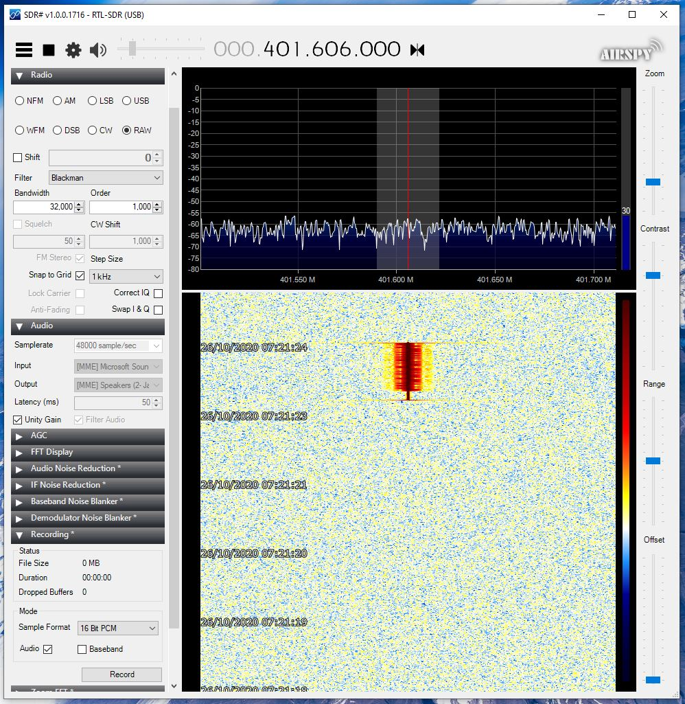

# SDR Sharp Howto
- If you are close to the transmitter:
  - In the Device settings:
    - disable RTL AGC
    - set the RF Gain to 0dB
- Tune SDR# to ~401.650Mhz
- In the Radio settings:
  - select RAW output mode
  - set bandwidth to 32khz
 In the Audio settings:
  - set gain to 'unity gain'
- In the Recording settings:
  - Select Audio
  - Deselect Baseband (the sample rate is _really_ high!)
- Run the program and pass the .wav file as an arg
  - e.g. demodARGOS.exe SDRSharp_20201025_223047Z_401606000Hz_IQ.wav
  - The wav file contains the 'short' example from A4-SS-TER-SP-0079-CNES
  - The Platform ID is 0x1234567
  - The complete over-air data stream, including sync pattern and length, is:
    - 0xAC53531C651CECA2F followed by 0b011
- Enjoy your bits =3
- Packets are saved to packets_YYYYMMDD_HHMMSS.txt file

